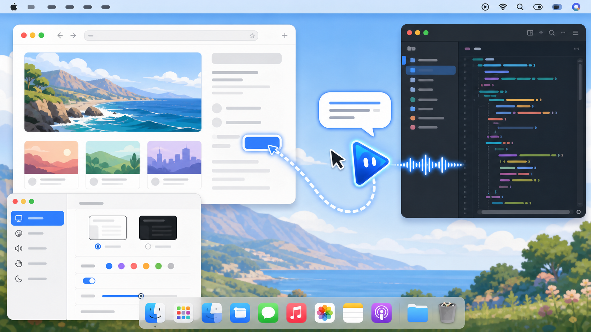

# 壮壮 (MiniMax)

> 基于 Clicky 改造的个人 Mac 语音伙伴。应用显示名为“壮壮”，英文内部产品名为 `Matilda`。



**一个跟着鼠标走、能看懂当前屏幕，也愿意随时和你聊两句的 Mac 语音伙伴。**

看到陌生的页面、找不到某个按钮，或者只是想弄明白眼前的内容时，按住 `Control + Option` 直接问壮壮。松开按键后，它会结合当前屏幕回答；如果答案涉及一个看得见的按钮、图标或文件，壮壮会跑到目标旁边，并用蓝色脉冲点标出准确位置。

## 怎么使用

1. 启动壮壮，它会待在 Mac 顶部菜单栏，并用头像跟随鼠标；
2. 按住 `Control + Option` 说出你对当前屏幕的疑问；
3. 松开按键，听取回答，或者跟着壮壮找到屏幕上的目标；
4. 没听清时打开菜单栏面板，查看并复制最近的对话。

你可以问它“这个页面是做什么的”“右上角那个按钮在哪里”“这个选项为什么不能用”，也可以针对正在看的内容继续追问。

## 它能做什么

- 跟随鼠标，在需要交流时随时出现；
- 理解当前屏幕，回答与页面、软件和操作步骤有关的问题；
- 找到可见的按钮、图标、文件或界面区域，让壮壮移动过去并用脉冲点进行引导；
- 使用语音连续交流，也可以在面板中查看和复制最近的回答；
- 按简短、默认或详细模式调整回答长度；
- 搜索、试听并调整壮壮的声音、音量、语速和音调；
- 在独立外观窗口中调整头像大小、鼠标距离、跟随速度、泛光颜色和强度；
- 鼠标静止时自动隐藏壮壮，默认等待 10 秒，移动鼠标或开始交流时立即重新出现；
- 支持多个显示器，并可在不同屏幕上进行视觉指引。

壮壮当前负责问答、屏幕解释和视觉指引，不会替你点击、输入或执行脚本。坐标由视觉模型判断，适合作为辅助指引，但不等同于原生 UI 自动化。项目目前也没有内置互联网搜索。

## 与原项目的关系

这个仓库是在 [farzaa/clicky](https://github.com/farzaa/clicky) 基础上的个人改造版，并保留原项目的 MIT License。

本项目保留了原版 Clicky 的 macOS 菜单栏助手和屏幕指引交互思路，并针对个人使用场景进行了持续改造：

- 将原有 Anthropic/Claude 模型链路替换为 MiniMax-M3 多模态问答；
- 使用 MiniMax TTS，并增加流式播放、音色浏览、试听、音量、语速和音调设置；
- 使用腾讯云实时 ASR，保留 Apple Speech 作为本地 fallback；
- 增加本地 Node 代理，在没有 Cloudflare 服务时也可以运行；
- 增加最近对话、复制、回答长度控制和更严格的屏幕指向策略；
- 移除原项目的遥测、发布脚本和当前版本不再使用的服务集成。

这不是 Anthropic 或 MiniMax 的官方项目，也不以完整桌面自动化为目标。当前版本主要用于语音问答、屏幕内容理解和视觉位置指引。

## 工作原理

一次完整的交流会经过下面几个步骤：

1. 壮壮通过腾讯云实时 ASR 将按住说话期间的语音转成文字；
2. App 截取当前屏幕，把问题、对话上下文和截图经代理发送给 MiniMax-M3；
3. 模型生成回答时，壮壮按句交给 MiniMax TTS 合成并流式播放，完整回答结束后再写入面板历史；
4. 当问题需要寻找可见目标时，模型返回归一化坐标，App 将其映射到对应显示器，移动壮壮并在目标中心显示脉冲点；
5. API Key 只保存在本地 Node 代理或 Cloudflare Worker 中，不写入 App 包。

## 系统要求

- macOS 14.2 或更高版本
- 较新的 Xcode（项目当前使用新版 Xcode 维护）
- Node.js 22 或更高版本
- MiniMax API Key
- 腾讯云 ASR 的 `AppID`、`SecretId` 和 `SecretKey`

## 快速启动

### 1. 配置本地代理

默认配置使用 `http://localhost:8787`，API Key 不写进 App。

```bash
cd worker
npm install
cp .dev.vars.example .dev.vars
```

编辑 `worker/.dev.vars`，至少填写：

```text
MINIMAX_API_KEY=你的_MiniMax_Key
TENCENT_ASR_APP_ID=你的腾讯云_AppID
TENCENT_ASR_SECRET_ID=你的腾讯云_SecretId
TENCENT_ASR_SECRET_KEY=你的腾讯云_SecretKey
```

`TENCENT_ASR_APP_ID` 是腾讯云账号/项目对应的数字 AppID，不是 SecretId。SecretId 和 SecretKey 在腾讯云访问管理中创建。

启动代理：

```bash
npm run local
```

浏览器直接访问 `http://localhost:8787/` 显示 `Method not allowed` 是正常的，因为代理只接受指定的 `POST` 路由。

### 2. 在 Xcode 运行 App

```bash
open leanring-buddy.xcodeproj
```

在 Xcode 中：

1. 选择 `leanring-buddy` scheme 和 `My Mac`；
2. 在 Signing & Capabilities 中选择自己的 Team；
3. 按 `Cmd + R` 构建并运行。

App 会出现在屏幕顶部菜单栏，不会出现在 Dock。首次运行需要授予：

- 麦克风：录制语音
- 辅助功能：监听全局 `Control + Option`
- 屏幕与系统录音：截取当前屏幕
- 屏幕内容：在壮壮面板中通过系统 Screen Content picker 允许读取可分享屏幕内容

权限通常与 App 的签名和安装位置绑定。开发时请始终从同一个 Xcode 工程运行，不要在终端使用 `xcodebuild`，否则可能生成不同实例并需要重新授权。

### 3. 开始使用

- 点击菜单栏中的壮壮头像打开面板；
- 按住 `Control + Option` 说话，松开后提交；
- 语音设置窗口可以搜索和试听 MiniMax 音色；
- 外观设置窗口可以实时预览壮壮的状态动画，并调整大小、距离、跟随感、泛光和自动隐藏时间；
- 只在明确询问当前屏幕位置、按钮、图标、文件等目标时才请求指向。

## 配置项

本地代理从 `worker/.dev.vars` 读取配置；Cloudflare Worker 使用 secrets 和 vars。

| 变量 | 必需 | 默认值 | 用途 |
|---|---:|---|---|
| `MINIMAX_API_KEY` | 是 | - | MiniMax 聊天、音色和 TTS |
| `TENCENT_ASR_APP_ID` | 是 | - | 腾讯云实时 ASR AppID |
| `TENCENT_ASR_SECRET_ID` | 是 | - | 生成腾讯 ASR 临时签名 |
| `TENCENT_ASR_SECRET_KEY` | 是 | - | 生成腾讯 ASR 临时签名 |
| `MINIMAX_API_HOST` | 否 | `https://api.minimax.io` | MiniMax API 域名 |
| `MINIMAX_CHAT_MODEL` | 否 | `MiniMax-M3` | 多模态聊天模型 |
| `MINIMAX_THINKING_TYPE` | 否 | `disabled` | `disabled`、`adaptive` 或 `omit` |
| `MINIMAX_TTS_MODEL` | 否 | `speech-2.8-turbo` | 语音合成模型 |
| `MINIMAX_TTS_VOICE_ID` | 否 | `Chinese (Mandarin)_Warm_Bestie` | 初始音色；面板设置会覆盖它 |
| `MINIMAX_TTS_VOLUME` | 否 | `1.0` | 初始合成音量；面板设置会覆盖它 |
| `TENCENT_ASR_ENGINE_MODEL_TYPE` | 否 | `16k_zh_en` | 腾讯 ASR 引擎 |
| `TENCENT_ASR_ENABLE_HOTWORDS` | 否 | `0` | 是否把上下文关键词发送给腾讯 ASR |

App 读取 [Info.plist](leanring-buddy/Info.plist) 中的：

- `WorkerBaseURL`：代理基础地址，默认 `http://localhost:8787`
- `VoiceTranscriptionProvider`：当前为 `tencent`

## 使用 Cloudflare Worker

本地代理不是强制要求。需要开机后无需手动启动 Node 服务时，可以部署 Cloudflare Worker：

```bash
cd worker
npm install
npx wrangler secret put MINIMAX_API_KEY
npx wrangler secret put TENCENT_ASR_APP_ID
npx wrangler secret put TENCENT_ASR_SECRET_ID
npx wrangler secret put TENCENT_ASR_SECRET_KEY
npx wrangler deploy
```

部署完成后，将 `leanring-buddy/Info.plist` 的 `WorkerBaseURL` 改为 Worker 地址。模型名称等非敏感默认值在 [wrangler.toml](worker/wrangler.toml) 中配置。

代理提供以下路由：

| 路由 | 用途 |
|---|---|
| `POST /chat` | MiniMax-M3 多模态流式问答 |
| `POST /tts` | 完整 MP3 合成，主要用于音色试听 |
| `POST /tts-stream` | 将 MiniMax SSE 音频帧转换为流式 MP3 |
| `POST /voices` | 获取 MiniMax 系统和账号音色 |
| `POST /transcribe-url` | 生成腾讯云实时 ASR 短期 WebSocket 签名地址 |

## 数据与隐私

- API Key 只保存在本地 `worker/.dev.vars` 或 Cloudflare secrets 中，不写进 App 包。
- 用户语音会发送给腾讯云 ASR。
- 用户文字、最近对话上下文和屏幕截图会经代理发送给 MiniMax。
- 项目不再包含原作者的 PostHog 遥测，不会把转写或模型回答发送到分析平台。
- `.gitignore` 已排除本地凭据、Node 依赖、构建产物、日志和生成音频。

## 架构

```text
macOS Matilda.app（显示名：壮壮）
  ├─ AVAudioEngine ──> Tencent ASR WebSocket
  ├─ ScreenCaptureKit ──> JPEG screenshots
  ├─ /chat ──> MiniMax-M3 SSE text for incremental TTS
  ├─ /tts-stream ──> MiniMax TTS SSE/MP3
  └─ NSStatusItem + NSPanel + transparent companion overlay

Proxy (local Node or Cloudflare Worker)
  ├─ stores API credentials
  ├─ forwards MiniMax requests
  └─ signs short-lived Tencent ASR URLs
```

核心文件：

```text
leanring-buddy/
  leanring_buddyApp.swift        菜单栏 App 入口
  CompanionManager.swift         语音、截图、LLM、TTS 和指向状态机
  MenuBarPanelManager.swift      NSStatusItem 与浮动面板
  CompanionPanelView.swift       主控制面板和对话历史
  VoiceSettingsView.swift        音色浏览、试听和参数设置
  ClaudeAPI.swift                MiniMax 兼容的流式视觉客户端
  ElevenLabsTTSClient.swift      MiniMax TTS 客户端（历史文件名）
  StreamingMP3AudioPlayer.swift  增量 MP3 播放
  BuddyTranscriptionProvider.swift  腾讯 ASR 与 Apple Speech fallback 工厂
  TencentASRStreamingTranscriptionProvider.swift
  OverlayWindow.swift            壮壮头像、状态动画与目标脉冲覆盖层
worker/
  local-server.mjs               本地代理
  src/index.ts                   Cloudflare Worker
```

完整的工程约定和文件职责见 [AGENTS.md](AGENTS.md)。

## 检查 Worker

```bash
cd worker
npm test
npm run typecheck
node --check local-server.mjs
```

Swift App 请通过 Xcode 界面构建和测试。`leanring-buddyTests` 保留了坐标、权限、指向策略、流式分句和 TTS 取消等回归测试；低价值的 UI Test target 已移除。

## 上游与许可证

原始项目：[farzaa/clicky](https://github.com/farzaa/clicky)。本仓库继续使用 [MIT License](LICENSE)。
